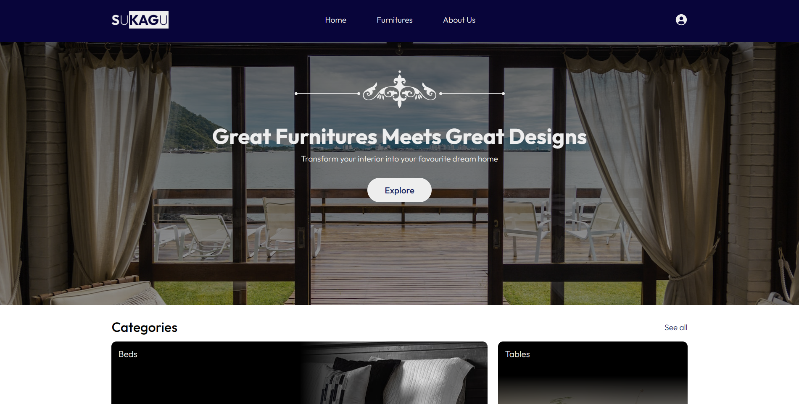

# Landing Page Website - Week 3

## 👋 Greetings!

This is a responsive landing page of a fictional website called **SUKAGU**, an online store selling furnitures or other home appliances. I hope you enjoy it ✌️.

## 🔗 Links

### [Go to Website](https://sukagusite.netlify.app/)

## ✨ Website Inspirations

- [Interior e-commerce website design by Alex](https://dribbble.com/shots/20500289-Interior-e-commerce-website-design)
- [Plant Landing Page by Omor](https://dribbble.com/shots/20510400-Plant-Landing-Page)

## 🎨 Design Resources

| Websites | Usage |
| :------- | ----: |
| [Unsplash](https://unsplash.com/) | Image Assets |
| [Pexels](https://www.pexels.com/) | Image Assets |
| [Colorhunt](https://colorhunt.co/) | Color Palettes |

| Colors | Code |
| :----- | ---: |
| Dark Blue | #0a023a |
| Blue | #141e61 |
| Grey | #787a91 |
| Whitesmoke | #EEEEEE |

### Fonts Used
- Outfit from [Google Fonts](https://fonts.google.com/specimen/Outfit)